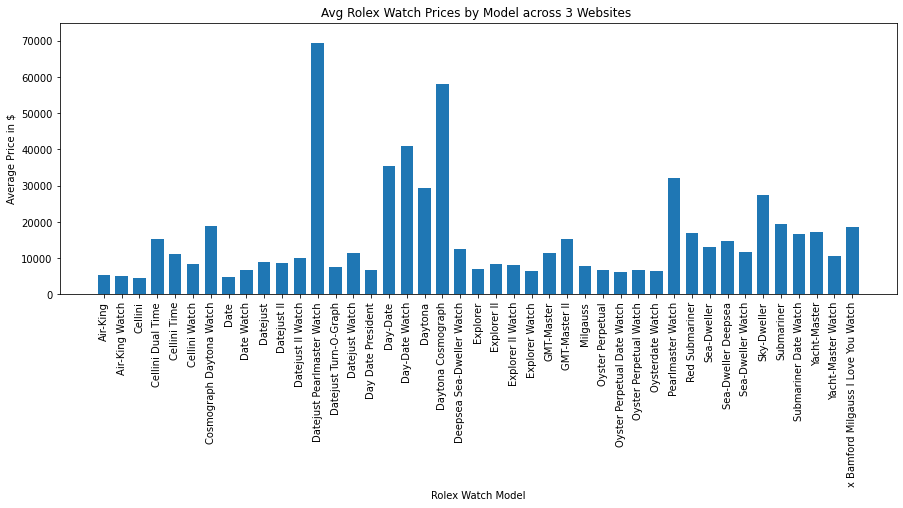

# Rolex-price
ETL Web-Scraping on Used Rolex watch prices

## Introduction:
Driven by a keen interest in Rolex watches,  I decided to browse the different models of the watch and see what are the price difference with the collection of data from three reputable watch sites.
I chose RealReal.com, Crownandcaliber.com, and Watchbox.com to gather data by web-scraping technique.

## Project Description:
1. Extracting data from scraping all three websites.
I scraped realreal.com and find the product id, watch brand, watch model, watch price and the link directly link to the website.

2. Transforming the data
Converted the data into a dataframe, followed by cleaning up the data by changing its data type and removed any unncessary symbols from the dataframe.

3. Loading the data into the database
First, I built a path to connect to the SQL server, followed by using the conn = engine.connect() function to connect to the database.
After connecting the data to the SQL server via Python, I read the data directly from the database.
To learn about the summary of watch prices with different models, I used dataframe.describe() to view the whole summary.
I created a graph to show the average price of each watches based on its model.

